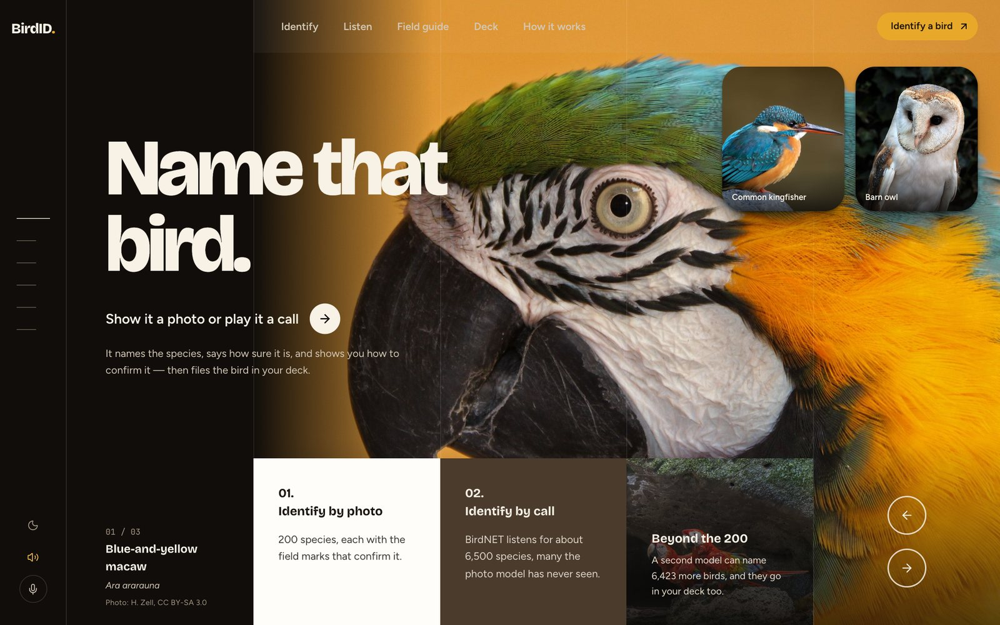
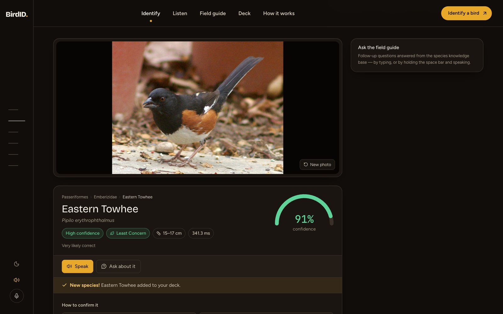
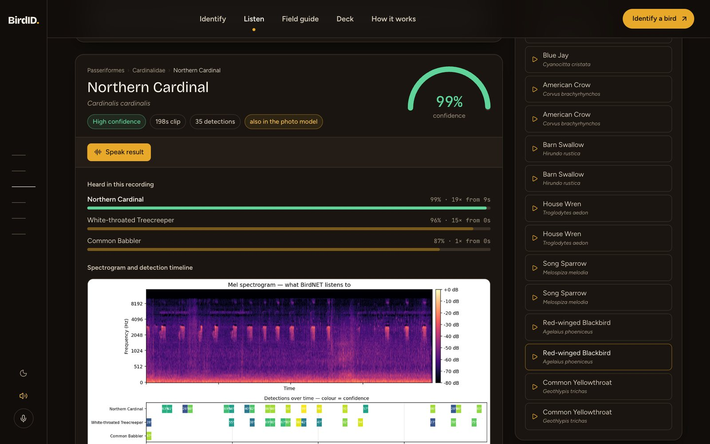
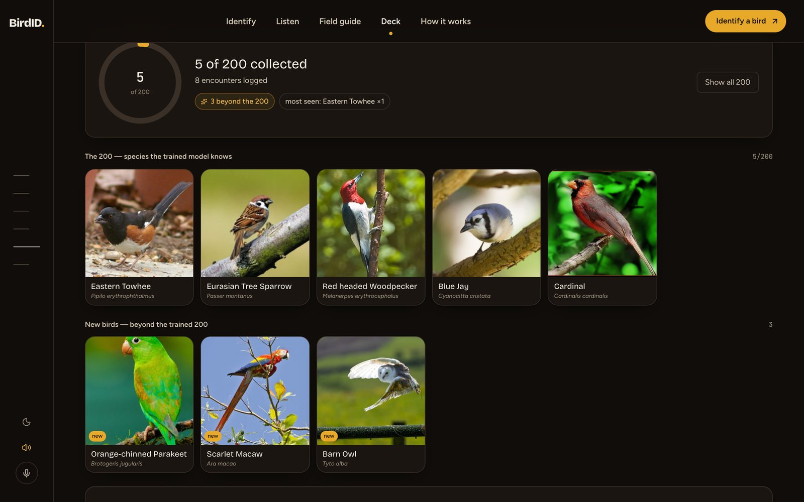
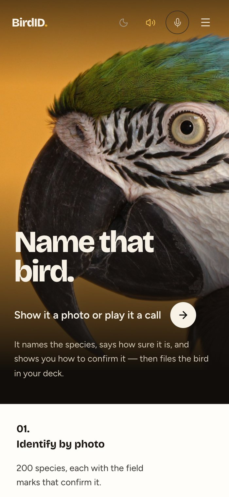
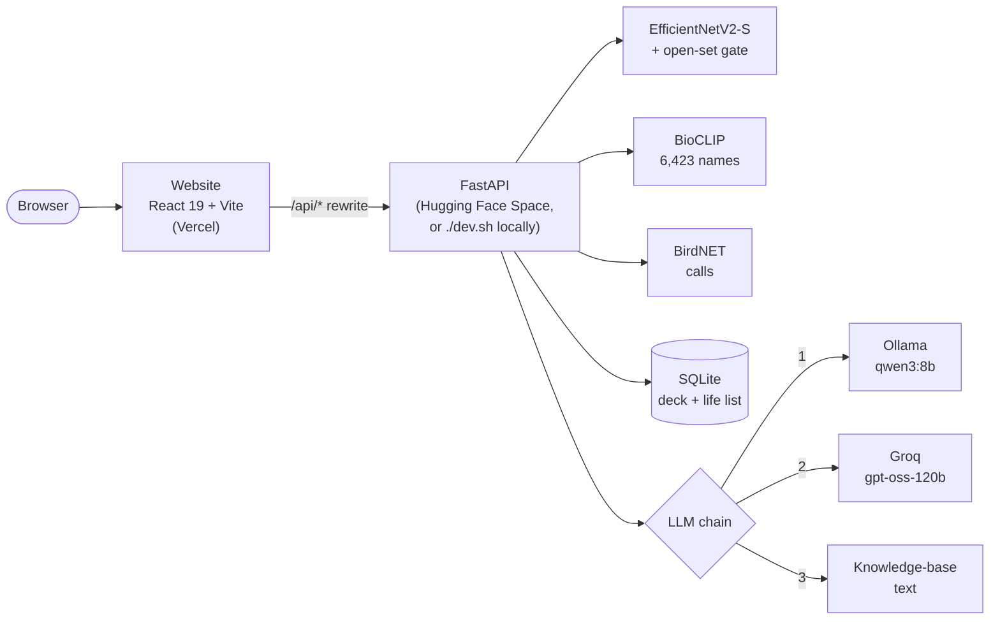

# BirdID

**Identify a bird from a photo or a recording, hear it described in a field-guide
voice, ask follow-up questions, and collect every bird you find into a deck.**

### [▶ Live demo — birdid-umber.vercel.app](https://birdid-umber.vercel.app)

[](https://birdid-umber.vercel.app)
[](https://huggingface.co/spaces/Mohitrks/birdid-api)
[](LICENSE)




BirdID runs entirely on your own machine — the models, the knowledge base and the
life list are all local, with no telemetry. The same code is also deployed as a
public demo: the website on Vercel, the API on a Hugging Face Space.

| | |
|---|---|
| **Website** | https://birdid-umber.vercel.app |
| **API** | https://mohitrks-birdid-api.hf.space ([interactive docs](https://mohitrks-birdid-api.hf.space/docs), [health](https://mohitrks-birdid-api.hf.space/api/health)) |

> **About the demo.** The API sleeps when nobody has used it for a while; the first
> visit then takes about a minute while it wakes, and the page fills in by itself.
> Everyone using the demo shares one deck, which resets when the Space restarts.

<table>
  <tr>
    <td width="50%"></td>
    <td width="50%"></td>
  </tr>
  <tr>
    <td></td>
    <td align="center"></td>
  </tr>
</table>

## What it does

**Identify by photo.** EfficientNetV2-S over the 200 species of CUB-200-2011.
You get the species, a confidence gauge, the taxonomy trail, the field marks that
confirm it, every look-alike with how to tell them apart, and a Grad-CAM overlay
showing which pixels drove the answer.

**Say when it does not know.** A 200-way softmax cannot answer "none of the
above" — it renormalises over the classes it has, so a photo of a frog used to
come back as a confident *Chuck-will's-widow*. An open-set gate reads the raw
logits and rejects inputs that are not one of the known species. It reliably
rejects things that are not birds; it only partially rejects birds outside the
200, and the numbers for both are printed in the app.

**Name the birds it was never trained on.** When the gate rejects a photo or
confidence drops below 60%, a second model gets a say. BioCLIP scores the image
against species *names* rather than a fixed class list, so its vocabulary is a data
file — 6,423 birds, 32× the trained model's reach. A macaw that the classifier
calls "White-breasted Kingfisher, 15%" comes back correctly named. Measured on 130
photos of 26 species deliberately outside the 200: **79% top-1** where the species
was in vocabulary, **91.5% precision** among the answers it commits to.

**Collect them.** Every photo files itself into a deck, one card per species,
Pokédex-style — no save button. Two sides: **The 200** the classifier covers, shown
as a completable grid with locked cards for what you have not found, and **New
birds** for everything the second model named from outside those 200. Photograph
the same bird twice and you get one card reading "×2", with the better photo kept.
When neither model is confident, nothing is filed and the app tells you why; a
wrong card is worse than a missing one.

**Identify by call.** BirdNET (Cornell Lab) covers ~6,500 species, so the Listen
section can name birds the photo model cannot — and it tells you which. Sixteen
Creative-Commons clips ship with the project so you can try it immediately.

**Voice, both directions.** The browser's Web Speech API reads a written summary
aloud, highlighting each sentence as it is spoken. Hold the mic button or the
space bar to speak a command: *"tell me about it"*, *"read the field marks"*,
*"save this"*, *"stop"*. Anything that is not a command becomes a question for the
grounded chat, and the answer is spoken back.

**Ask the field guide.** A language model answers questions grounded in a
200-species knowledge base. Facts are supplied from the knowledge base and echoed,
never recalled from the model, so sizes and conservation statuses cannot be
invented. The model is found through a three-level chain, so the feature never
errors:

1. **Ollama**, locally — `qwen3:8b`, the same model that wrote the knowledge base;
2. **Groq**, when no local model is running and `GROQ_API_KEY` is set — this is
   what the public demo uses;
3. **the knowledge-base entry itself**, plainly introduced, when neither answers.

**Life list.** Every encounter is logged to a SQLite file alongside the deck — the
deck dedupes by species, the log keeps the history.

## Accuracy: read this first

**The bundled checkpoint's accuracy figures are not trustworthy, and the app says
so on every screen that shows one.**

It carries no record of what it was trained on, and measured evidence says it saw
essentially all of CUB-200-2011: official-test images that were never held out
score ~95%, *above* the ~86–88% realistic ceiling for this architecture, and
higher than images it definitely trained on. That is the signature of a data
leak. The species it names are usually right; the confidence number is not a
calibrated probability of being right.

The fix is in the repository. [`train.py`](train.py) trains against the committed
split manifests in [`data/splits/`](data/splits/) and records their SHA-256 in the
checkpoint. Any checkpoint carrying that hash is picked up automatically and the
warnings disappear:

```bash
python3 scripts/make_split.py          # official CUB split, hashed manifests
python3 train.py                       # ~85-88% top-1 is the honest range
python3 scripts/fit_openset.py         # refit the gate for the new logit scale
```

Species notes are machine-written too: [`data/species_kb.json`](data/species_kb.json)
was generated locally by `qwen3:8b` and is not expert-verified. Hand-written
entries are labelled *curated* / *verified* in the UI; everything else is
labelled as generated. The **How it works** section lays all of this out.

## Architecture



```
bird_data.py        curated lookup tables + display_name(), no torch
bird_core.py        model, knowledge base, open-set gate — returns dicts
bird_text.py        dict -> the plain-text report Gradio shows
bird_eval.py        slow offline harnesses (metrics, calibration)
api.py              FastAPI — the interface the website talks to
services/
  llm.py            narration, grounded chat, comparison: Ollama → Groq → template
  verifier.py       BioCLIP: open-vocabulary ID for birds outside the 200
  sightings.py      SQLite life list + the deck
bird_complete_local.py   Gradio debug UI
bird-frontend/      React website (single long-scroll page, dark + light themes)
deploy/space/       Hugging Face Space entry point, requirements and card
scripts/            training, evaluation, data and deployment tools
```

The important rule: **`bird_core` returns dictionaries, never formatted text.**
One structured payload feeds the website, the narrator, the chat grounding and the
life list. Before this, the predictors returned ASCII reports, the frontend had to
regex-scrape them, and most of the knowledge base never reached the screen.

`api.py` loads the model once at import. Do not run it with multiple workers on a
laptop: each worker would load its own copy of the checkpoint.

## Run it locally

Requires Python 3.11+ and Node 20+.

```bash
pip3 install -r requirements.txt -r requirements-api.txt
cd bird-frontend && npm install && cd ..
```

A checkpoint named `best_bird_model_inference.pth`, `best_bird_model.pth` or
`best_bird_model_official.pth` must be in the project root (or set
`BIRD_MODEL_PATH`). Checkpoints and datasets are gitignored — they are large and
re-downloadable. BirdNET also needs a TensorFlow Lite runtime (`tensorflow` or
`tensorflow-cpu`); without one, call identification switches itself off.

Optional extras — without them everything still works, and the UI labels what is
missing:

```bash
# Spoken summaries, chat and comparison prose from a local model
pip3 install -r requirements-llm.txt
ollama pull qwen3:8b && ollama serve

# ...or from Groq when Ollama is not running
cp .env.example .env        # then set GROQ_API_KEY — the file is gitignored

# Naming birds outside the trained 200 (downloads ~400 MB of BioCLIP once)
pip3 install -r requirements-verify.txt
python3 scripts/eval_verifier.py
```

Then:

```bash
./dev.sh                 # API :8000 + website :5173, Ctrl-C stops both
./dev.sh start|stop|restart|status
```

Open **http://localhost:5173**. `dev.sh` loads `.env` automatically.

| Port | | |
|---|---|---|
| **:5173** | website | React + Vite, proxies `/api` to :8000 |
| **:8000** | JSON API | `/docs` for the interactive schema |
| **:7860** | Gradio | debug surface, `./run.sh start` |

## Deploy

The public demo is two free-tier services, and neither needs code changes to
redeploy.

**API → Hugging Face Space.** Docker Spaces need a paid plan, so the API runs on a
Gradio-SDK Space on free ZeroGPU hardware. [`deploy/space/app.py`](deploy/space/app.py)
serves the same FastAPI app with uvicorn, pins inference to the CPU, and warms
BioCLIP in the background. One command uploads only what the API needs at
runtime (code, knowledge base, thresholds, audio samples and the 79 MB
checkpoint — about 111 MB) and creates the Space on first run:

```bash
hf auth login                                   # a token with write access
python3 scripts/deploy_space.py --repo USER/birdid-api --dry-run
python3 scripts/deploy_space.py --repo USER/birdid-api --groq-secret
```

`--groq-secret` copies `GROQ_API_KEY` from your environment into the Space's
secrets without printing it.

**Website → Vercel.** [`bird-frontend/vercel.json`](bird-frontend/vercel.json)
rewrites `/api/*` to the Space, so the site keeps using relative URLs — no CORS, no
build-time configuration. Point the rewrite at your Space, then:

```bash
cd bird-frontend && vercel --prod
```

## Scripts

| Script | Purpose |
|---|---|
| `scripts/make_split.py` | Official CUB split with hashed manifests |
| `train.py` | Train an auditable checkpoint (Colab notebook in `notebooks/`) |
| `scripts/fit_openset.py` | Fit the open-set threshold; sweeps four score families and picks by AUROC |
| `scripts/eval_verifier.py` | Measure the open-vocabulary verifier on 26 non-CUB species, fit its threshold |
| `scripts/build_species_kb.py` | Generate the species knowledge base via Ollama |
| `scripts/validate_kb.py` | Gate the knowledge base (placeholders, IUCN values, binomials) |
| `scripts/download_bird_audio.py` | Fetch CC-licensed calls from Wikimedia |
| `scripts/download_openset_photos.py` | Fetch the in-distribution and OOD photo sets |
| `scripts/deploy_space.py` | Publish the API to a Hugging Face Space |

Rerun `fit_openset.py` after changing the checkpoint — the logit scale is
checkpoint-specific, and a stale threshold silently rejects real birds. Rerun
`eval_verifier.py` if the BirdNET label file or the prompt template changes.

## Tests

```bash
python3 -m pytest              # 87 tests, ~15s from cold
```

- `tests/test_core_schema.py` pins the result-dict contract that four consumers
  read, and covers the open-set gate end to end.
- `tests/test_deck.py` covers all four routing branches, species-level dedupe,
  and that new birds never inflate progress over the 200.
- `tests/test_api.py` covers the HTTP surface with `TestClient`, the LLM and the
  verifier stubbed — including that a missing model degrades rather than 500s,
  and that the streaming chat answers from the knowledge base instead of
  showing an error.
- `tests/test_llm_chain.py` pins the provider chain offline: who is asked, in
  what order, who gets credited, and that every failure lands on text.

Tests that need the gitignored datasets skip rather than fail, and the deck is
redirected to a scratch database.

Frontend: `cd bird-frontend && npm run lint && npm run build`.

`npm run contrast` is the gate for the design tokens. It verifies every
documented foreground/background pair in both themes, asserts that the
`scope-night` patches (side rail, hero, footer) still match the dark theme,
asserts the values `src/index.css` records as *rejected* still fail, and holds
the photo grain to a luminance budget. Run it after touching any token.

## Environment variables

| Variable | Default | Purpose |
|---|---|---|
| `BIRD_MODEL_PATH` | auto-detected | Checkpoint to load |
| `BIRD_DEVICE` | auto | Force `cpu`, `cuda` or `mps` |
| `BIRD_SAVE_DIR` | `evaluation/` | Where generated PNGs go |
| `BIRD_TEST_DIR` | `birds_split/test` | Evaluation image folder |
| `BIRD_DB_PATH` | `data/sightings.db` | Life-list database |
| `BIRD_LLM_ORDER` | `ollama,groq` | Language-model providers, tried in order |
| `BIRD_LLM_MODEL` | `qwen3:8b` | Ollama model |
| `BIRD_LLM_KEEP_ALIVE` | `15m` | How long Ollama holds the weights |
| `BIRD_LLM_TIMEOUT` | `60` | Seconds before an Ollama call gives up |
| `GROQ_API_KEY` | unset | Enables Groq as the fallback when Ollama is not running |
| `BIRD_GROQ_MODEL` | `openai/gpt-oss-120b` | Groq model |
| `BIRD_GROQ_TIMEOUT` | `20` | Seconds before a Groq call gives up |
| `BIRD_VERIFIER_MODEL` | `hf-hub:imageomics/bioclip` | Open-vocabulary model |
| `BIRD_VERIFY_BELOW` | `0.60` | Confidence under which the verifier is consulted |

## Credits and licensing

This project is released under the [MIT License](LICENSE). The datasets, models
and media it depends on carry their own terms, listed below.

- **CUB-200-2011** — Caltech-UCSD Birds, Wah et al. 2011.
- **BirdNET** — Cornell Lab of Ornithology, via `birdnetlib`.
- **BioCLIP** — Stevens et al. 2024, `imageomics/bioclip`. Candidate species names
  come from BirdNET's label file, filtered to birds: it is a sound model, so it also
  lists 92 frogs, crickets and katydids, and unfiltered a Bald Eagle ranked as
  "Honey Bee".
- **Photographs** — the eight bird photos in `bird-frontend/public/photos/` are
  from Wikimedia Commons (CC BY, CC BY-SA, CC0 or public domain), resized for the
  web. Author, licence and source for each are in
  [`src/lib/photos.js`](bird-frontend/src/lib/photos.js) and shown in the site's
  footer.
- **Audio and open-set photos** — Wikimedia Commons, all CC or public domain.
  Attribution for every file is in `bird_audio_samples/manifest.json` and
  `data/openset/manifest.json`, which are committed for exactly that reason.
- **Animated nav indicator** — the shared-`layoutId` technique is adapted from
  ibelick's Animated Tabs on 21st.dev (MIT), hand-ported to plain JSX.
- **Open-set scoring** — max-softmax (Hendrycks & Gimpel 2017), energy
  (Liu et al. 2020). Energy is the usual recommendation and measures *worse than
  random* on this checkpoint; softmax entropy wins here. The script measures
  rather than assumes.
